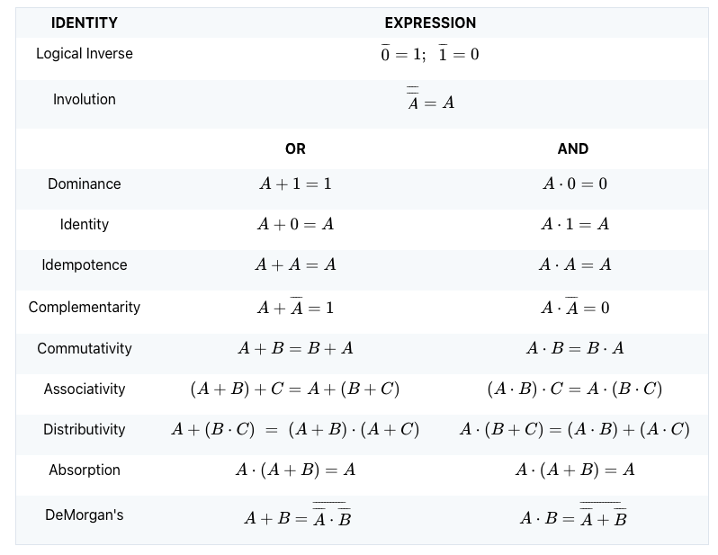
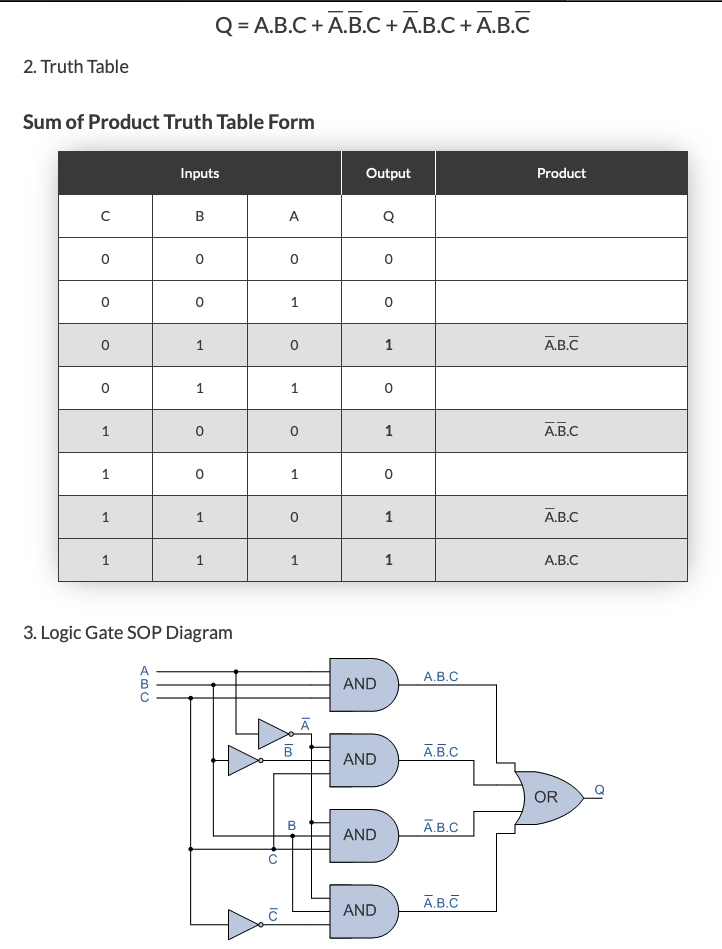
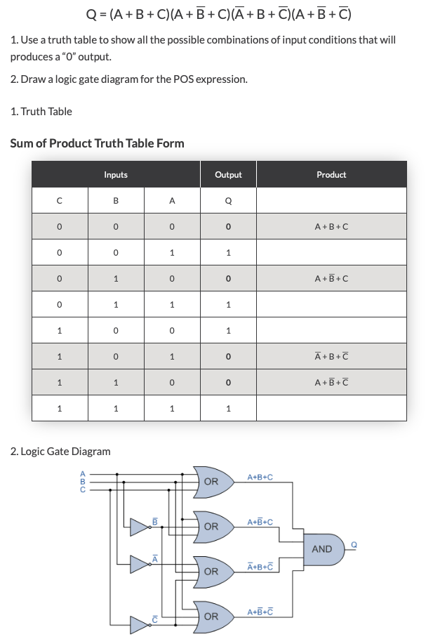

# Boolean Algebra

Boolean algebra is an algebra for the manipulation of objets that can take on only two values.

## Boolean Expressions

Combining the variables and operators yields __Boolean Expressions_. A boolean function typically has one or more input values and yields a result, based on these input variables in the range [0,1].

There are three common Boolean operators, `AND` (`.`), `OR` (`+`), and `NOT` (`~`).

## Boolean Identities

Boolean expressions can be _simplified_, with _identities_ or laws that apply to Boolean algebra.

## Function Representation

There are an infinite number of Boolean expressions that are _logically equivalent to one another_. To avoid potential confusion, we use a __canonical or standardized form__, which is unique for any given Boolean function.

### Sum of Products

### Product of Sums

## Logic Gates

Digital circuits are constructed from a number of primitive elements called _gates_, which implement each of the basic logic boolean functions.

To physically implement each gate requires from one to six or more transistors. The basic physical component of a computer is the transistor, the basic logic element is the gate.

### Basic Gates

* AND
* OR
* NOT

### Univeral Gates

* NAND (complementary and) - used to express __sum-of-products__.
* NOR (complementary or) - used to express __product-of-sums__.

NAND and NOR are commonly referred to as _as universal gates_ becaue any electronic circuit can be constructed using only one of those gates.

## Combinational Circuits

The output of a combinational circuit is a function of its inputs, thus, output is always based entirely on the given inputs.

A given combinational circuit may have several outputs. If so, each output represents a different Boolean function.

* Full Adder
* Ripple-Carry Adder
* Decoder
* Encoder
* Multiplexer
* Demultiplexer
* Parity Generator / Checker
* ALUs

### Encoder

One-hot to binary converter. Converts from 2^n input lines, where at most only one of them will ever be high, to n-bit output lines.

Encoders are used to convert an analogue signal to a digital signal, to compress multiple number of inputs into a smaller number of outputs.

#### Prioirt Encoders

A normal encoder has a number of input lines amongst whih only one of which is activated at a given time while a priority encoder has more than one input, which is activated based on priority.

Priority encoders are used to control interrupt requests by acting according to the highest priority request.

### Decoder

Uses the inputs and their respective values to select one specific output line, meaning that one unique output line is asserted.

All memory addresses in a computer are specified as binary numbers. When a memory address is referenced, the computer first has to determine the actual address. This is done using a decoder.

### Multiplexer

Selects binary information from one of many input lines and directs it to a single output line.

Selection of a particular input line is controlled by a set of selection variables, or control lines.

At any given time, only one input is routed through the circuit to the output line. All other inputs are "cut off".

Time sharing computers multiplex the input from user terminal. Modem pools multiplex the modem lines entering the computer.

### Demultiplexer

Device that takes a single input line and routes it to one of several digital output lines. A demultiplexer of 2^n outputs has n select lines, which are used to select which output line to send the input. The difference with a de coder is that a demultiplexer contains select lines as well.

A Demultiplexer is also called a data distributor.

### Partity Generator / Checker

A Parity Generator is a circuit that creates the necessary parity bit to add to a word.

A Parity Checker checks to make sure proper parity (odd or even) is present in the word, detecting an error if the parity bit is incorrect.

## Sequential Circuits

The major weakness of combinational circuits is that there is no concept of storage.

A sequential circuit defines its output as a function of both its current inputs and its previous inputs.

* Clocks
* Flip-Flop
  * SR - Set/Reset
  * JK - Jack Kilby, SR variant
  * D - Data
* Registers
* Counters
* Memories

### Clocks

The fact that a sequential circuit uses past inputs to determine present outputs indicates we must have __event ordering__. Some sequential circuits are _Asynchronous_, which means they become active the moment any input value changes. _Synchronous_ sequential circuits use clocks to order events.

A Clock emits a series of pulses with a precise pulse width and a precisa interval between consecutive pulses. This interval is called the __Clock Cycle Time__. Clock Speed is generally measured in megahertz (MHz), or millions of pulses per second.

A Clock is used by a sequential circuit to decide __when to update the state of the circuit__. This means that inputs to the circuit can only affect the storage element at given, discrete instances of time.

### Flip Flops

A level-triggered circuit is allowed to change state whenever the clock signal is either high or low. Technically, a __Latch__ is level triggered, whereas __Flip-Flop__ is edge triggered.

#### Feedback

In order to "_remember_" a past state, sequential circuits rely on a concept named __feedback__. This simply means the output of a circuit is fed back as an input to the same circuit.
